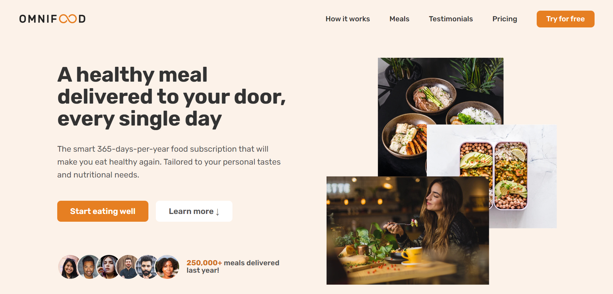
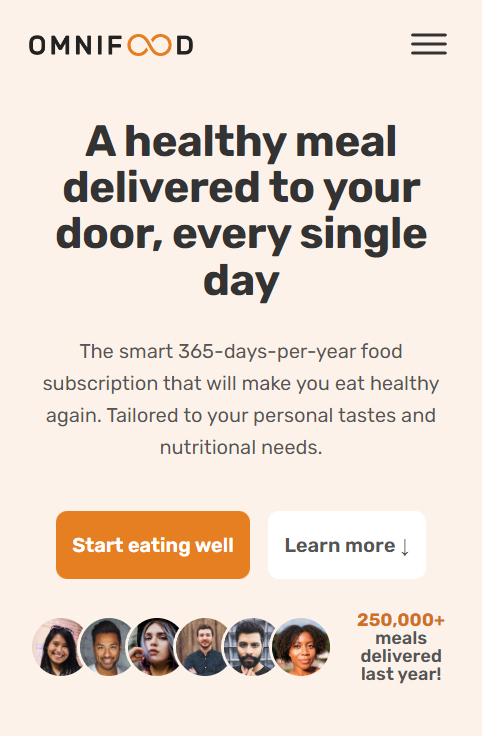

# OMNIFOOD PROJECT - Responsive Website

This project was part of [Jonas Schmedtmann's "Build Responsive Real-World Websites with HTML and CSS"](https://www.udemy.com/course/design-and-develop-a-killer-website-with-html5-and-css3/) course on Udemy.

## Table of contents

-   [Project Overview](#project-overview)
-   [Omnifood Website](#omnifood-website)
    -   [Screenshots](#screenshots)
    -   [Links](#links)
-   [Process](#process)
    -   [Built with](#built-with)
    -   [What I learned](#what-i-learned)
    -   [Continued development](#continued-development)
    -   [Useful resources](#useful-resources)

## Project Overview

The Omnifood project was designed by Jonas Schmedtmann (i.e. was a follow-along coding project) and was the culmination of his course, bringing together all the aspects taught in the course about HTML, CSS and best practices for the design of responsive websites. In the [content.md file](https://github.com/VTickner/Omnifood-Project/blob/main/content.md) is the overall synopsis of Omnifood and the requirements for the website.

## Omnifood Website

### Screenshots

Desktop:  


Mobile:  


### Links

-   Solution URL: [https://github.com/VTickner/Omnifood-Project](https://github.com/VTickner/Omnifood-Project)
-   Live Site URL: [https://omnifood-vt.netlify.app/](https://omnifood-vt.netlify.app/)

## Process

-   This was a follow-along coding project but gave a lot of insight into how to approach various aspects of creating a responsive website.

### Built with

-   Desktop-first responsive workflow
-   HTML5
-   CSS3
    -   Flexbox
    -   CSS Grid
    -   Mobile navigation on smaller screens
-   SVG Icons
-   JavaScript for:
    -   Set the current year in the copyright statement
    -   Mobile navigation
    -   Sticky navigation
    -   Smooth scrolling animation

### What I learned

The main learning experience with this project was being able to follow along to see the process and particularly the thought process that goes into different design decisions for creating a website.

I also learnt that having a system for sizing fonts and whitespace is really useful to help keep a consistent style with the layout of the website. Plus I learnt how to create and also switch between a mobile and non-mobile navigation system depending upon the screen size.

A number of new (to me) CSS techniques:

-   Structuring of CSS to enable easier re-use and finding of CSS elements.
-   Use transition to add a smooth transition when hovering.
-   Use \*:focus to create styling that fits in with the website design, but enables accessibility for those who use a keyboard to tab between clickable items.
-   If adding other logos e.g. for a featured in section or for social media can use filter: brightness(0) to turn them black and then use opacity to make them a grey colour, so can then have them all with the same colour.
-   Use transform: translate to help position items; transform: scale, when combined in a hover state, creates a zoom-in feature
-   Set default font-size to % to avoid accessibility issues (standard screen size is 16px and to make 1rem = 10px do: 10px / 16px \* 100 = 62.5%).

```css
html {
    font-size: 62.5%;
}
```

-   @media queries do not inherit any html font-size that was set and cannot use rem so need to use em instead for responsive sizing and have to assume 1rem = 1em = 16px e.g.

```css
@media (max-width: 84em) {
    /* media query for screen sizes below 1344px (1344px / 16px = 84em) */
}
```

-   Using rem for font sizes for the website allows the use of @media queries to alter the root font size on the html element to reduce text size on smaller screens.

### Continued development

To put into practice using the techniques and processes learnt to help style and improve responsiveness and accessibility of websites that I create.

### Useful resources

-   [Ionicons](https://ionic.io/ionicons) - Free, open source icon library.
-   [Tint & Shade Generator](https://maketintsandshades.com/) - Free tool that calclulates tints and shades for your default colour, to enable you to create a cohesive colour scheme.
-   [Coolers Colour Contrast Checker](https://coolors.co/contrast-checker/112a46-acc8e5) - Free tool that allows you to check the colour contrast of the text to background colour for accessibility / readability purposes.
-   [Pexels Photos](https://www.pexels.com/) - Free stock royal free photos and images.
-   [Unsplash Photos](https://unsplash.com/) - Free stock royal free photos and images.
-   [Squoosh App](https://squoosh.app/) - Free tool that reduces image sizes.
